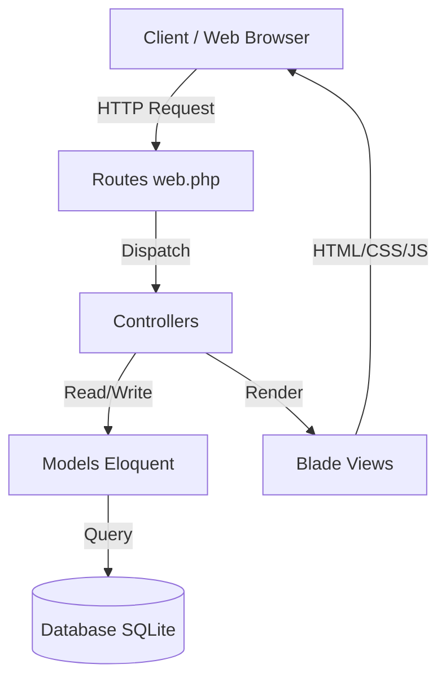

# Veto Nusvaa (Bad Habit & Relapse Tracker)

<p align="center">
  
  
  
  
</p>

Aplikasi berbasis web untuk melacak dan mengelola kebiasaan buruk (vices) serta mencatat riwayat kambuh/pelanggaran (relapses).

Tujuan proyek ini adalah membantu pengguna untuk secara aktif memantau dan menghentikan kebiasaan buruk mereka dengan mencatat setiap pelanggaran yang terjadi serta menghitung hari tanpa pelanggaran (streak days).

## Preview Proyek

Aplikasi ini menyediakan manajemen pengguna dengan peran (Admin & User), antarmuka untuk mencatat kebiasaan buruk, dan kemampuan untuk mencatat pelanggaran beserta alasannya.


*(Catatan: Screenshot aplikasi belum tersedia, silakan ganti placeholder ini dengan screenshot asli)*

## Fitur Utama

- **Autentikasi & Otorisasi**: Fitur Login, Register, dan Logout dengan role-based access control (Admin dan User).
- **Manajemen Vices (Kebiasaan Buruk)**: Pengguna dapat menambah (Create), melihat (Read), mengubah (Update), dan menghapus (Delete) kebiasaan buruk yang ingin dihentikan. Mencakup klasifikasi severity (rendah, sedang, tinggi).
- **Pencatatan Relapses (Pelanggaran)**: Mencatat log kapan pelanggaran atau kambuh terjadi beserta alasan (excuse).
- **Pelacakan Streak**: Sistem melacak *streak days* atau jumlah hari berturut-turut tanpa melakukan kebiasaan buruk.
- **Admin Dashboard**: Panel khusus bagi admin untuk mengelola pengguna (melihat daftar pengguna dan mereset password).

## Teknologi yang Digunakan

- **Bahasa Pemrograman**: PHP 8.2, JavaScript
- **Framework**: Laravel 11.0
- **Frontend**: Tailwind CSS v4.2, Vite
- **Database**: MySQL (konfigurasi default), didukung driver database Laravel lainnya.
- **Library Utama**: Pest (Testing Framework)
- **Tools Pendukung**: Composer, NPM, Node.js

## Arsitektur Sistem

Proyek ini menggunakan arsitektur **MVC (Model-View-Controller)** yang merupakan bawaan dari framework Laravel:
- **Model**: Mengelola data, logika bisnis terkait data, dan interaksi database (e.g., `User`, `Vice`, `Relapse`).
- **View**: Menangani presentasi UI menggunakan Blade Template Engine dan styling dari Tailwind CSS.
- **Controller**: Menangani HTTP request, memproses alur data dari Model, dan mengembalikannya ke View (e.g., `AuthController`, `VicesController`).



## Struktur Folder

Beberapa folder penting dalam arsitektur aplikasi ini:

- `app/` - Berisi core logic aplikasi seperti Models, Controllers, dan Middleware.
- `routes/` - Berisi definisi routing aplikasi (`web.php`).
- `database/` - Berisi file migration database dan seeder.
- `resources/` - Berisi file tampilan (Blade templates) dan raw assets (CSS/JS).
- `public/` - Direktori root untuk web server, berisi aset publik dan build Vite.
- `tests/` - Berisi file automated testing.

## Persyaratan Sistem

- PHP >= 8.2
- Node.js & NPM
- Composer

## Instalasi

Ikuti langkah-langkah berikut untuk menjalankan aplikasi di lingkungan lokal:

1. **Clone repository**
   ```bash
   git clone <url-repository>
   cd veto-nusvaa
   ```

2. **Install dependency PHP & Node.js**
   ```bash
   composer install
   npm install
   ```

3. **Konfigurasi Environment**
   ```bash
   cp .env.example .env
   php artisan key:generate
   ```

4. **Setup Database (SQLite)**
   ```bash
   touch database/database.sqlite
   php artisan migrate
   ```

5. **Build Aset Frontend**
   ```bash
   npm run build
   ```

6. **Menjalankan Aplikasi**
   ```bash
   php artisan serve
   ```
   Aplikasi dapat diakses melalui `http://localhost:8000`.

## Konfigurasi Environment

Berikut adalah beberapa variabel `.env` utama yang digunakan:
- `APP_NAME`: Nama aplikasi.
- `APP_ENV`: Lingkungan aplikasi (`local`, `production`).
- `APP_KEY`: Kunci enkripsi aplikasi (di-generate otomatis).
- `APP_DEBUG`: Mode debug (harus `false` di production).
- `DB_CONNECTION`: Jenis koneksi database (secara default `sqlite`).

## Cara Penggunaan

1. Buka aplikasi di browser.
2. Buat akun baru pada halaman Register atau Login menggunakan akun yang sudah ada.
3. Akses halaman Home/Dashboard.
4. Tambahkan "Vice" (kebiasaan buruk) baru yang ingin dihentikan, tentukan severity-nya.
5. Jika Anda melakukan pelanggaran, tambahkan log "Relapse" yang terkait dengan Vice tersebut dengan menyertakan tanggal dan alasan.
6. Pantau *streak days* Anda untuk melihat progres penghentian kebiasaan buruk.

## API Documentation

*Belum teridentifikasi dari source code.* (Aplikasi ini utamanya adalah aplikasi monolitik berbasis web yang merender Blade template langsung dari controller. Belum ada spesifikasi API khusus di `routes/api.php`.)

## Database Schema

- **`users`**: Menyimpan data pengguna. (Kolom: `id`, `name`, `email`, `password`, `role`, dll).
- **`vices`**: Menyimpan daftar kebiasaan buruk. (Kolom: `id`, `user_id`, `habit_name`, `description`, `severity`, `streak_days`).
- **`relapses`**: Menyimpan log pelanggaran kebiasaan buruk. (Kolom: `id`, `vices_id`, `violation_date`, `excuse`).

**Relasi Antar Tabel:**
- `User` memiliki banyak (hasMany) `Vice`.
- `Vice` dimiliki oleh (belongsTo) `User`.
- `Vice` memiliki banyak (hasMany) `Relapse`.
- `Relapse` dimiliki oleh (belongsTo) `Vice`.

## Deployment

Cara deploy aplikasi ke server production:
1. Setup web server (Nginx/Apache) dengan PHP-FPM.
2. Arahkan Document Root server ke folder `public/`.
3. Pastikan folder `storage/` dan `bootstrap/cache/` memiliki permission yang dapat ditulis (writable) oleh web server.
4. Sesuaikan file `.env` (Set `APP_ENV=production` dan `APP_DEBUG=false`).
5. Jalankan optimasi Laravel:
   ```bash
   php artisan config:cache
   php artisan route:cache
   php artisan view:cache
   ```
6. Build aset untuk production: `npm run build`.

## Testing

Proyek ini dilengkapi dengan setup testing bawaan Laravel.

- **Cara Menjalankan**:
  ```bash
  php artisan test
  ```
- **Jenis Testing**: Feature & Unit testing (menggunakan framework Pest).

## Security

- **Praktik Keamanan**:
  - Hashing password menggunakan algoritma Bcrypt yang aman.
  - Perlindungan Cross-Site Request Forgery (CSRF) pada setiap route dan form berjenis POST/PUT/DELETE.
  - Mencegah serangan SQL Injection menggunakan Eloquent ORM.
  - Validasi hak akses menggunakan Middleware (`auth`, `guest`, `admin`).
- **Peringatan Deployment**: Selalu pastikan `APP_DEBUG` diset ke `false` di production untuk menghindari tereksposnya informasi sensitif dari pesan error.

## Troubleshooting

- **Error `No application encryption key has been specified`**
  Solusi: Jalankan perintah `php artisan key:generate`.
- **Database error `no such table`**
  Solusi: Pastikan database sudah dibuat dan jalankan `php artisan migrate`.
- **Styling/CSS tidak termuat atau "Vite manifest not found"**
  Solusi: Jalankan `npm run build` atau jalankan Vite dev server dengan `npm run dev` pada terminal terpisah.

## Roadmap

- **Selesai**: Autentikasi dasar, role management (User & Admin), fitur CRUD untuk Vices dan Relapses.
- **Akan Datang**: *Belum teridentifikasi dari source code.* (Saran fitur ke depan: Grafik perkembangan streak, notifikasi email, sistem penghargaan/gamifikasi).

## Kontribusi

1. Fork repository ini.
2. Buat branch fitur baru (`git checkout -b feature/FiturBaru`).
3. Commit perubahan Anda (`git commit -m 'Menambahkan FiturBaru'`).
4. Push ke branch (`git push origin feature/FiturBaru`).
5. Buka Pull Request untuk direview.

## License

Proyek ini dilisensikan di bawah [MIT License](https://opensource.org/licenses/MIT).

## Author

*Belum teridentifikasi dari source code.*
*(Tambahkan informasi profil Github atau kontak pembuat proyek di sini)*
